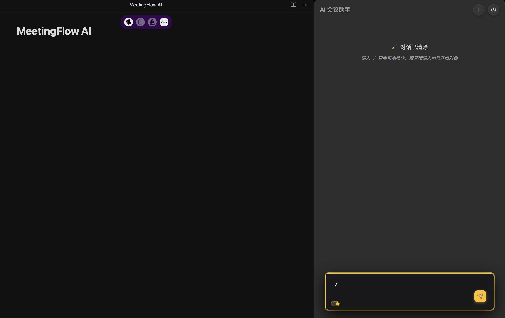

# MeetingFlow AI

**基于 AI 的 Obsidian 实时会议转录和分析工具**

[](https://github.com/your-repo/meeting-flow-ai/releases)
[](LICENSE)
[](https://obsidian.md/)

通过实时语音转文本转录和智能 AI 分析，将您的会议转化为可搜索、可操作的笔记。

---




## 功能特性

- **实时转录** - 兼容 OpenAI realtime标准 Websocket协议
- **AI 助手** - 自动生成摘要和行动项目
- **多语言支持** - 支持中/英语言主题
- **隐私保护** - 端到端不保留用户数据
- **无缝集成** - 直接在 Obsidian 中工作

## 快速开始

1. **安装**：下载并复制到 `YourVault/.obsidian/plugins/`
2. **配置**：在设置中添加您的 WebSocket地址与API 密钥
3. **开始**：点击松鼠图标功能键或按 `Ctrl+F9` 开始转录
4. **使用**：使用AI会议助手进行会议总结

## 使用方法

### AI会议助手内置核心命令
- `/summary` - 生成会议摘要
- `/action-items` - 提取任务和决策
- `/translate [语言]` - 翻译内容
- `/help` - 显示所有可用命令

### API 配置
在插件设置中配置您的语音转文本服务：

```json
{
  "apiEndpoint": "wss://api.openai.com/v1/realtime",
  "apiKey": "your-api-key",
  "model": "whisper-1"
}
```

## 安全与隐私

- **本地处理**：转录内容直接存储在您的 Obsidian 保险库中
- **不保留数据**：音频处理后不存储
- **企业就绪**：支持自托管和自定义端点

## 系统要求

- Obsidian 桌面版
- OpenAI API 密钥或兼容的 STT 服务
- 麦克风访问权限

## 许可证

[MIT 许可证](LICENSE) - 个人和商业使用免费。

---

**将您的会议从时间浪费者转变为生产力强大的工具。**